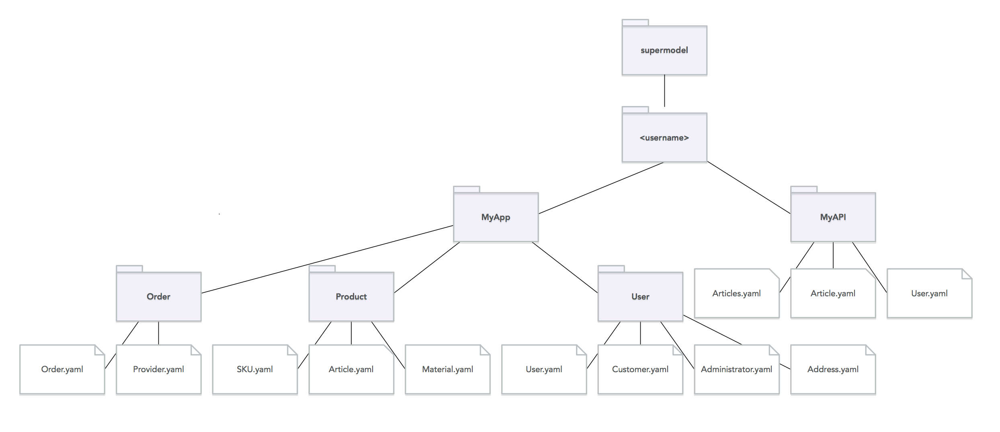

# Supermodel CLI

[](http://supermodel.io)

The Supermodel CLI is used to manage and work with JSON Schema YAML models from the command line.

For more information about Supermodel visit <https://supermodel.io>.

## Overview
Supermodel JSON Schema models are JSON schemas files written in YAML format. By convention on YAML file represents one model.
It is also customary for all Supermodel models to include a model id (JSON Schema `$id` field). See [Supermodel JSON Schema Model](#supermodel-json-schema-model) for more details.

Models can be freely arranged in the directory structure under the `supermodel` (precisely `supermodel/<username>`) directory. It is recommended that the directory structure reflects the application domains and subdomains to further ease the organization of models.



The Supermodel CLI then facilitates the creation of these models as well as working with them. Refer to [Usage Examples](#usage-examples) for some examples of how can be the Supermodel CLI used.

## Installation

```
$ npm i -g supermodel-cli
```

## Getting Started
After the installation, login into the [Supermodel.io](http://supermodel.io):

```
$ supermodel login
--> Logged as 'username'
```

Your account is need for two reasons. First, to make your model identifiers globally unique and second, to enable publishing your models at [Supermodel.io](http://supermodel.io). If you haven't created an account at [Supermodel.io](http://supermodel.io) you can do so from the command line using the `supermodel signup` command.


When you are logged in, initialize the current directory and create your first model:

```
$ supermodel init MyApp
--> Created ./supermodel/<username>/MyApp
```

The first parameter (`MyApp`) of the `init` command should represent your application, team or domain. This, together with your Supermodel user name will be used as the base path for all the model identifiers created in the initialized supermodel directory.

After you have initialized the supermodel directory, step into it:

```
$ cd ./supermodel/<username>/MyApp
```

And go ahead and create your first model:

```
$ supermodel model create MyModel
--> Created model 'MyModel' as MyModel.yaml
```

```
$ open MyModel.yaml
```

You can open `MyModel.yaml` in an editor and edit it as necessary. When you are ready to create your next models simply use the `supermodel model create <name>` command again. You can also nest models in directories as long as they are nested under the initial `supermodel/<username>` directory.

Refer to [Supermodel JSON Schema Model](#supermodel-json-schema-model) for more details about the Supermodel Model or learn about some [usage examples](#usage-examples)

## JSON Schema Functionality
This CLI tool currently supports the following JSON schema operations:

- **YAML to JSON Conversion**

    Converts JSON Schema in YAML format to JSON format

    ```
    $ supermodel schema json <modelPath>
    ```

- **JSON Schema Validation**

    Validates JSON Schema meta schema (read: validates that your JSON Schema is valid)

    ```
    $ supermodel schema validate <path>
    ```

- **JSON Schema Compilation**

    Compiles multiple Supermodel JSON Schema model files into one

    ```
    $ supermodel schema compile <dir>
    ```

- **Resolve JSON Schema References**

    Resolves all remote `$ref`s in a Supermodel JSON Schema model file, transcluding the referenced definitions in the output schema file

    ```
    $ supermodel schema resolve <modelPath>
    ```

- **Conversion to OpenAPI Specification 2.0**

    Converts Supermodel JSON Schema model to [OpenAPI Specification](https://github.com/OAI/OpenAPI-Specification/blob/master/versions/2.0.md) definitions object

    ```
    $ supermodel schema oas2 <modelPath>
    ```

- **Conversion to GraphQL schema**

    Converts Supermodel JSON Schema model to [GraphQL](https://graphql.org/) schema

    ```
    $ supermodel schema graphql <modelPath>
    ```

## Usage Examples

### Validate Data Models in CI/CD Pipeline
Supermodel CLI is a CI/CD compliant CLI tool, that is it's `schema validate` command can be used as a part of CI testing, to validate the data models against its meta schema

```
$ supermodel schema validate <path>
$ echo $?
0
```

### Convert Data Models into Self-contained OpenAPI Spec 2.0
Converts a model or set of models (via `supermodel schema compile`) if `<path>` is a directory into OAS2 definitions. If the `-o` parameter is provided it replaces the definitions section in the existing OAS2 document.

```
$ supermodel schema oas2 <pathToModel(s)> -o <pathToOAS2>
```

## Supermodel JSON Schema Model
A Supermodel model (hereafter just "model") is a plain [JSON Schema (draft 7)](http://json-schema.org/specification.html) schema file in YAML format. It is customary that Supermodel model contains a top-level type definition, its title and it starts with the model (`$id`).

At minimum a Supermodel model file looks like:

```yaml
$id: http://supermodel.io/username/MyModel

title: My Model
type: object
```

A Supermodel model might reference another model as defined in [JSON Schema references with `$ref`](http://json-schema.org/latest/json-schema-core.html#rfc.section.8):


```yaml
$id: http://supermodel.io/username/MyModel

title: My Model
type: object

properties:
  modelProperty:
    $ref: http://supermodel.io/username/AnotherModel
```

If the referenced model `http://supermodel.io/username/AnotherModel` shares the same URI base with the `$id` of the referencing model (in this case `http://supermodel.io/username/MyModel`) a relative identifier might be used:

```yaml
$id: http://supermodel.io/username/MyModel

title: My Model
type: object

properties:
  modelProperty:
    $ref: AnotherModel
```

See [JSON Schema specification](http://json-schema.org/specification.html) for more about JSON Schema references and JSON pointer.

## Developing Supermodel CLI
After cloning this repository you can either:

1. copy .env.development into .env `cp ./.env.development ./.env` and change variables for your needs
2. symlink `ln ./.env.development ./.env`

## A Good API Project

supermodel.io (http://supermodel.io), and supermodel CLI (https://github.com/supermodel/supermodel-cli) are Good API (http://goodapi.co) non-profit projects, aimed at promoting modern, reusable, and sustainable data modeling.
